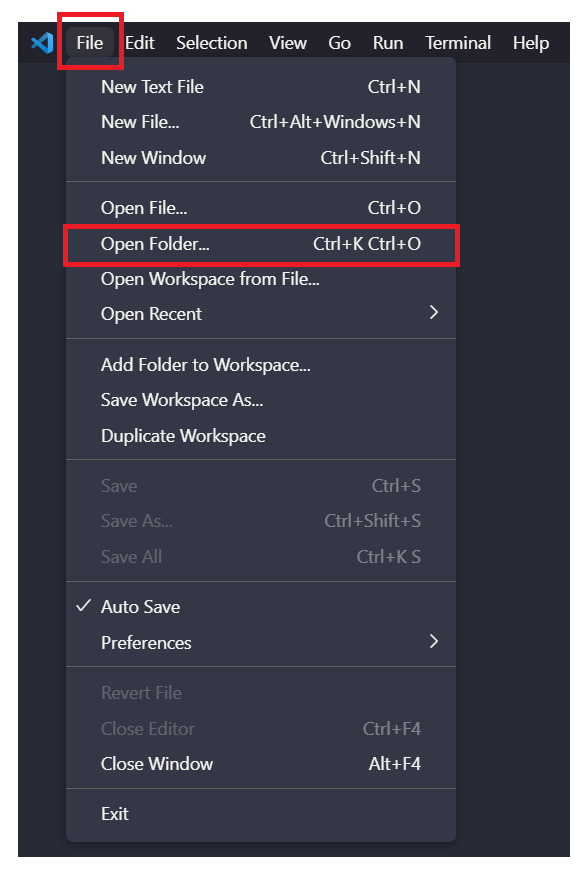

<h1>  Đồ Án Cuối Kỳ - Đồ Họa Máy Tính CS105.M21.KHCL</h1>

## I. Các bước để chạy source code

### Cách 1:
- Bước 1: Cài đặt [Visual Studio Code](https://code.visualstudio.com/download")

- Bước 2: Cài đặt [Live Sever extension](https://ritwickdey.github.io/vscode-live-server/)

- Bước 3: Mở thư mục source code bằng `Visual Studio Code`
   (Chọn File -> Open Folder -> chọn thư mục source code)

- Bước 4: Chờ cho thanh trạng thái (`Status Bar`) nằm ở dưới dùng màn hình load xong, click vào "`Go Live`" 

### Cách 2:
Vào trực tiếp [Link GitHub](https://shenggkai.github.io/Final-Project-CS105/)

---
## II. Video demo
    Link: 
---
## III. Danh sách thành viên nhóm
- 19520271 - Hồ Bảo Quốc Thắng
- 19521338 - Nguyễn Quốc Đạt
- 20521363 - Lê Quang Hùng
- 20522069 - Lê Phước Trung 